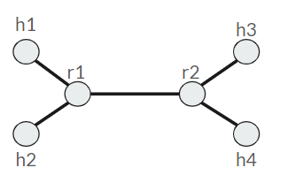
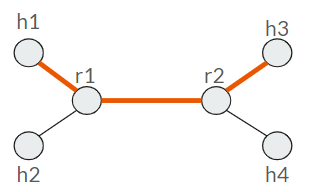
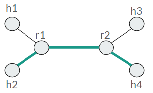
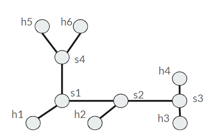
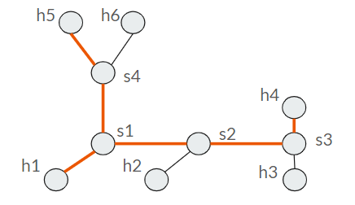
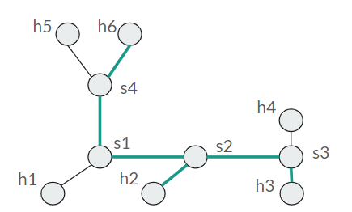

# On Demand SDN Slices in ComNetsEmu #

## Short Introduction ##

The goal of the project is to implement a network slicing approach to enable dynamic activation/de-activation of network slices via CLI/GUI commands. 

## Project Description: ##

In this project a CLI application was developed. Its main function is to generate rules that will be inserted into the switch table flows. The latter will allow the activation and deactivation of slices given a basic network topology.

This folder contains the following files:

1. my_network_A.py: Python script to build the network described in network_topology_A.txt
2. my_network_B.py: Python script to build the network described in network_topology_B.txt
3. snd_controller.py: Python script where is implemented an OpenFlow 1.0 L2 learning switch
4. main_network.py: Python script where the data structures (such as classes and methods) are defined to implement the slice activation and deactivation operations
5. cli_application.py: Python script where the command line interface is defined. The commands are associated with the functions present in main_network.py
6. saved_object.pkl: memory of the CLI application
7. network_topology_A.txt, slice_one_topology_A.txt, slice_two_topology_A.txt, network_topology_B.txt, slice_one_topology_B.txt, slice_two_topology_B.txt: text files that contain the description of the network topology or slices.
8. terminal_test.txt: file text where the command executed by the CLI application in the shell are writed in order to understand how the CLI application works


The network will be generated using Mininet and simultaneously running an OpenFlow 1.0 L2 learning switch. At the same time the entire network topology and any slices will be described in text files with the use of an ad hoc template (described subsequently). 

The network topology and slice templates will be added to the CLI application memory. This will allow, based on the commands sent to the CLI application, to perform the function for which the CLI application is designated.

The available commands of the CLI application are the following:

- for adding the basic network topology and a slice respectively. Their description is contained in the text files respectively network_topology_A.txt and slice_one_topology_A.txt
  * python3 cli_application.py add -t .\network_topology_A.txt
  * python3 cli_application.py add -s .\slice_one_topology_A.txt
- for the activation/deactivation of a specific slice. It is always necessary to specify the name of the file associated with the slice.
  * python3 cli_application.py activate -s .\slice_one_topology_A.txt
  * python3 cli_application.py deactivate -s .\slice_one_topology_A.txt
- for viewing the CLI application memory on stdout. That is, the basic topology present, the slices present and their relative active/inactive status
  * python3 cli_application.py show
- for deleting the network topology (this also involves deleting all slices)
  * python3 cli_application.py delete -t .\network_topology_A.txt
- for deleting a particular slice
  * python3 cli_application.py delete -s .\slice_one_topology_A.txt

In text files describing the network topology (e.g. network_topology_A.txt), the network is represented as follows. 

The first section "HostToRouter" describes the connections between hosts and routers in pairs.
The second section "RouterToRouter" describes the connections between two routers in pairs. For example, in this case the switch s2 can be reached from s1 via the eht1 port. Conversely, s1 can be reached from s2 via the eht1 port.
```
HostToRouter
(h1,s1)
(h2,s1)
(h3,s2)
(h4,s2)
RouterToRouter
(s1-eth1,s2-eth1)
```
Instead, in text files describing the slice topology (e.g. slice_one_topology_A.txt), the slice is represented as follows.
Here, the only difference with the previous template is the specification of the percentage of bandwidth of the link between the switches
```
HostToRouter
(h1,s1)
(h3,s2)
RouterToRouter
(s1-eth1-70,s2-eth1-70)

```


### Example A ###

#### How to Run ####

1. Enabling Ryu controller to load the application and to run in the background:
```bash
$ ryu-manager sdn_controller.py &
```

2. Starting the network with Mininet: 
```bash
$ sudo python3 my_network_A.py
```

*Note 1:* Please stop the running Ryu controller before starting a new Ryu controller. For example, type `htop` in the terminal to show all running processes, press the key `F4` to look for the process *ryu-manager*, then press the key `F9` to stop the process, with the key `F10` to quite `htop`.

*Note 2:* When you want to stop the mininet, please delete the topology as follows:
```bash
mininet> exit
$ sudo mn -c
```

#### How to Verify ####

1. Add the topology contained in the file text network_topology_A.txt. Network topology A is the following:

```bash
$ sudo python3 cli_application.py add -t .\network_topology_A.txt
```
There is no active slice and therefore the network is completely stopped. In fact, checking the connectivity the result is the following:

- ping mode: verifying connectivity, e.g.:
```bash
mininet> pingall
*** Ping: testing ping reachability
h1 -> X X X  
h2 -> X X X  
h3 -> X X X  
h4 -> X X X 
*** Results: 100% dropped (0/12 received)
```

2. Then add a slice and activate it. For example, add slice_one_topology_A.txt. When it asks, enter the id representing the slice one from the keyboard, for example 123.
Slice one topology A is the following:



```bash
$ sudo python3 cli_application.py add -s .\slice_one_topology_A.txt
```
```bash
$ sudo python3 cli_application.py activate -s .\slice_one_topology_A.txt
```

3. Verify the isolation of the slice in Mininet with pingall command. Then verify bandwidth between host that belong to the slice with iperf mode. Remember that the percentage of the link is indicated in the file slice_one_topology_A.txt.

- pingall mode: verifying slice_one_topology_A isolation:
```bash
mininet> pingall
*** Ping: testing ping reachability
h1 -> X h3 X  
h2 -> X X X  
h3 -> h1 X X 
h4 -> X X X 
*** Results: 83% dropped (2/12 received)
```

- iperf mode: verifying slice_one_topology_A bandwidth:
```bash
mininet> iperf h1 h3
*** Iperf: testing TCP bandwidth between h1 and h3 
*** Results: ['4.54 Mbits/sec', '5.01 Mbits/sec']
```

4. Then, add the other slice: slice_two_topology_A.txt. When it asks, enter the id representing the slicer two from the keyboard, for example 234.
Slice two topology A is the following:



```bash
$ sudo python3 cli_application.py add -s .\slice_two_topology_A.txt
```
If you want to visualize the actual configuration of the network use the command show.
```bash
$ sudo python3 cli_application.py show
```
It should show the following. As we expected, we can see that the "slice one topology A" is active (slice_state is true), whereas "slice two topology A" is not active (slice_state is False).

```
Network_topology: network_topology_A.txt
HostToRouter
(h1,s1)
(h2,s1)
(h3,s2)
(h4,s2)
RouterToRouter
(s1-eth1,s2-eth1)
Slices:
slice_name:slice_one_topology_A.txt     slice_id:123    slice_state:True
slice_topology:
HostToRouter
(h1,s1)
(h3,s2)
RouterToRouter
(s1-eth1-70,s2-eth1-70)
slice_name:slice_two_topology_A.txt     slice_id:234    slice_state:False
slice_topology:
HostToRouter
(h2,s1)
(h4,s2)
RouterToRouter
(s1-eth1-10,s2-eth1-10)
```

5. Then, activate the slice_two_topology_A.
```bash
$ sudo python3 cli_application.py activate -s .\slice_two_topology_A.txt
```
Verify the isolation of the slice in Mininet with pingall command. Then verify bandwidth between host with iperf mode.

- pingall mode: verifying slice_two_topology_A isolation:
```bash
mininet> pingall
*** Ping: testing ping reachability
h1 -> X h3 X 
h2 -> X X h4 
h3 -> h1 X X
h4 -> X h2 X
*** Results: 66% dropped (4/12 received)
```

- iperf mode: verifying slice_two_topology_A bandwidth:
```bash
mininet> iperf h2 h4
*** Iperf: testing TCP bandwidth between h2 and h4
*** Results: ['745 Kbits/sec', '1.41 Mbits/sec']
```


### Example B ###

#### How to Run ####

1. Enabling Ryu controller to load the application and to run in the background:
```bash
$ ryu-manager sdn_controller.py &
```

2. Starting the network with Mininet: 
```bash
$ sudo python3 my_network_B.py
```

*Note 1:* Please stop the running Ryu controller before starting a new Ryu controller. For example, type `htop` in the terminal to show all running processes, press the key `F4` to look for the process *ryu-manager*, then press the key `F9` to stop the process, with the key `F10` to quite `htop`.

*Note 2:* When you want to stop the mininet, please delete the topology as follows:
```bash
mininet> exit
$ sudo mn -c
```

#### How to Verify ####

1. Add the topology contained in the file text network_topology_B.txt. Network topology B is the following:

```bash
$ sudo python3 cli_application.py add -t .\network_topology_B.txt
```
There is no active slice and therefore the network is completely stopped. In fact, checking the connectivity the result is the following:

- ping mode: verifying connectivity, e.g.:
```bash
mininet> pingall
*** Ping: testing ping reachability
h1 -> X X X X X 
h2 -> X X X X X 
h3 -> X X X X X 
h4 -> X X X X X
h5 -> X X X X X
h6 -> X X X X X
*** Results: 100% dropped (0/30 received)
```

2. Then add a slice and activate it. For example, add slice_one_topology_B.txt. When it asks, enter the id representing the slice two from the keyboard, for example 123.
Slice one topology B is the following:



```bash
$ sudo python3 cli_application.py add -s .\slice_one_topology_B.txt
```
```bash
$ sudo python3 cli_application.py activate -s .\slice_one_topology_B.txt
```

3. Verify the isolation of the slice in Mininet with pingall command. Then verify bandwidth between host that belong to the slice with iperf mode. Remember that the percentage of the link is indicated in the file slice_one_topology_B.txt.

- pingall mode: verifying slice_one_topology_B isolation:
```bash
mininet> pingall
*** Ping: testing ping reachability
h1 -> X X h4 h5 X 
h2 -> X X X X X 
h3 -> X X X X X 
h4 -> h1 X X h5 X
h5 -> h1 X X h4 X
h6 -> X X X X X
*** Results: 80% dropped (6/30 received)
```

- iperf mode: verifying slice_one_topology_B bandwidth:
```bash
mininet> iperf h1 h4
*** Iperf: testing TCP bandwidth between h1 and h4 
*** Results: ['2.83 Mbits/sec', '3.90 Mbits/sec']
mininet> iperf h1 h5
*** Iperf: testing TCP bandwidth between h1 and h5 
*** Results: ['765 Kbits/sec', '990 Kbits/sec']
mininet> iperf h5 h4
*** Iperf: testing TCP bandwidth between h5 and h4
*** Results: ['756 Kbits/sec', '973 Kbits/sec']
```

4. Then, add the other slice: slice_two_topology_B.txt. When it asks, enter the id representing the slicer two from the keyboard, for example 234.
Slice two topology B is the following:



```bash
$ sudo python3 cli_application.py add -s .\slice_two_topology_B.txt
```
If you want to visualize the actual configuration of the network use the command show.
```bash
$ sudo python3 cli_application.py show
```
It should show the following. As we expected, we can see that the "slice one topology B" is active (slice_state is true), whereas "slice two topology B" is not active (slice_state is False).

```
Network_topology: network_topology_B.txt
HostToRouter
(h1,s1)
(h2,s2)
(h3,s3)
(h4,s3)
(h5,s4)
(h6,s4)
RouterToRouter
(s1-eth1,s4-eth1)
(s1-eth2,s2-eth1)
(s3-eth1,s2-eth2)
Slices:
slice_name:slice_one_topology_B.txt     slice_id:123    slice_state:True
slice_topology:
HostToRouter
(h1,s1)
(h4,s3)
(h5,s4)
RouterToRouter
(s1-eth1-10,s4-eth1-10)
(s1-eth2-50,s2-eth1-50)
(s3-eth1-50,s2-eth2-50)
slice_name:slice_two_topology_B.txt     slice_id:234    slice_state:False
slice_topology:
HostToRouter
(h2,s2)
(h3,s3)
(h6,s4)
RouterToRouter
(s1-eth1-50,s4-eth1-50)
(s1-eth2-50,s2-eth1-50)
(s3-eth1-10,s2-eth2-10)
```

5. Then, activate the slice_two_topology_B.
```bash
$ sudo python3 cli_application.py activate -s .\slice_two_topology_B.txt
```
Verify the isolation of the slice in Mininet with pingall command. Then verify bandwidth between host with iperf mode.

- pingall mode: verifying slice_two_topology_B isolation:
```bash
mininet> pingall
*** Ping: testing ping reachability
h1 -> X X h4 h5 X 
h2 -> X h3 X X h6 
h3 -> X h2 X X h6
h4 -> h1 X X h5 X
h5 -> h1 X X h4 X
h6 -> X h2 h3 X X
*** Results: 60% dropped (12/30 received)
```

- iperf mode: verifying slice_two_topology_B bandwidth:
```bash
mininet> iperf h2 h3
*** Iperf: testing TCP bandwidth between h2 and h3 
*** Results: ['1.40 Mbits/sec', '1.73 Mbits/sec']
mininet> iperf h6 h2
*** Iperf: testing TCP bandwidth between h6 and h2 
*** Results: ['2.88 Mbits/sec', '3.97 Kbits/sec']
mininet> iperf h3 h6
*** Iperf: testing TCP bandwidth between h3 and h6
*** Results: ['1.27 Mbits/sec', '1.60 Mbits/sec']
```


## Implementation Details ##

### Contributing

The Contributors of this project are the following:
- Luca Caccavale: luca.caccavale@studenti.unitn.it


